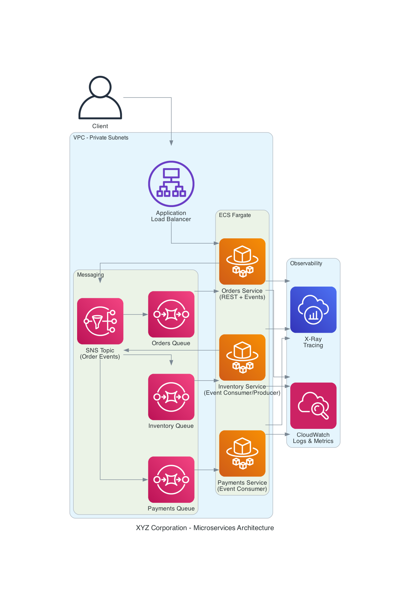

# XYZ Corporation - Microservices Architecture Overview

## Overview  
The XYZ platform is a distributed microservices system deployed on AWS. Services communicate using synchronous REST APIs and asynchronous event-driven messaging.

## Core Services  
- Orders Service (REST + event producer)
- Inventory Service (event consumer/producer)
- Payments Service (event consumer)

## Communication Patterns
- REST: Client --> Orders Service
- Async Events: SNS --> SQS --> downstream services

## AWS Runtime
- Compute: Amazon ECS Fargate
- Messaging: SNS topics with SQS subscriptions
- Networking: VPC with private subnets
- Observability: CloudWatch Logs, Metrics, X-Ray

## Diagram

